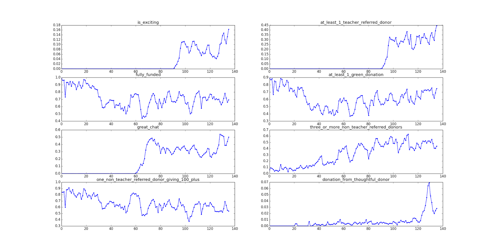

+++
title = "Predicting Excitement at DonorsChoose.org"
date = 2020-06-01T19:54:38+08:00
outputs = ["Reveal"]

[reveal_hugo]
slide_number = true

custom_theme = "stylesheets/mycustom.scss"
custom_theme_compile = true
+++

# Predicting Excitement at DonorsChoose.org

报告人：张海斌

---

{}

## 问题描述

* 项目全部都由学校的老师提出
* 从项目中筛选出更受投资者青睐的 **Exciting Projects**
* 二分类问题（是否为 *Exciting Projects* ）

---

### Exciting Projects 评定标准

满足以下五个条件

（以下数据都不会出现在测试的输入数据中）

* 全资资助 `fully_funded`
* `at_least_1_teacher_referred_donor`
* 投资人留下的消息多于平均值 `great_chat`
* `at_least_1_green_donation`
* 满足以下至少一个条件：
  * `three_or_more_non_teacher_referred_donors`
  * `one_non_teacher_referred_donor_giving_100_plus`
  * `donation_from_thoughtful_donor`

---

### 训练数据

发布于2014年1月1日之前的项目为训练数据，之后的为测试数据

文件|内容
---|---
`donations.csv`|每一笔捐款的详细信息
`essays.csv`|提出项目的老师的项目描述
`projects.csv`|每个项目的信息
`resources.csv`|项目所需资源
`outcomes.csv`|项目投资结果

---

### 测试数据

{}
{}
输入

* 项目描述 essays
* 项目信息 projects
* 项目所需资源 resources
{}

{}
输出

* 项目是否为 *Exciting Project*
* 测试数据结果：`sampleSubmission.csv`
{}
{}

---

`projects.csv`

* projectid
* teacher_acctid
* schoolid
* primary_focus_subject
* primary_focus_area
* poverty_level
* fulfillment_labor_materials
* total_price_excluding_optional_support
* total_price_including_optional_support
* students_reached
* date_posted

---

{}
{}

`essays.csv`

* projectid
* teacher_acctid
* title
* short_description
* need_statement
* essay

{}
{}

`resources.csv`

* resourceid
* projectid
* vendorid
* vendor_name
* project_resource_type
* item_name
* item_number
* item_unit_price
* item_quantity

{}
{}

{}

---

{}

## 数据分析

---

各参数数据随时间分布情况

---

### 数据不均衡

正例（Exciting Projects）只占 5.9274%

可以考虑通过调节分类权重或者选择基于 ROC 的学习方法

{}

---

{}

## 数据预处理

* 数据缺失：根据数值所占百分比随机填充或者从其它数据项中复制数据
  * `secondary_focus_subject`, `secondary_focus_area` 缺失率比较高，可以直接用 `primary_focus_*` 数据填充
* 离散数据编码（规范化编码）
* 类别的 features 转化为 One-Hot 编码
* 连续的特征分入不同的 buckets 来离散化
  * 如项目发布日期根据月份划分

---

### 特征提取

* 从项目描述文档中可以提取出很多特征
  * 文档长度
  * tf–idf(term frequency-inverse document frequency) transform

{}

---

## 模型训练

* 十折交叉验证
* 指标：AUC

---

{}

## 模型选择

{}
{}
尝试

* 逻辑回归
* 决策树
* 随机森林
{}
{}

进一步考虑

* 模型融合
{}
{}

{}
