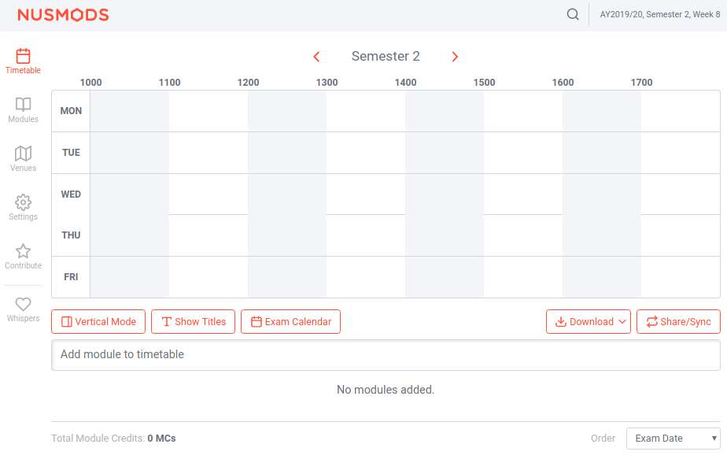
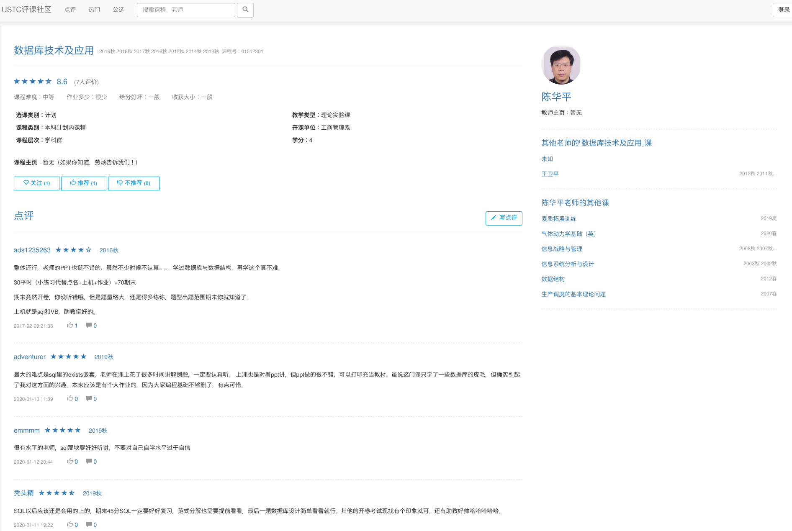
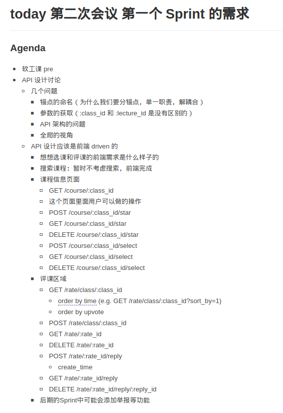
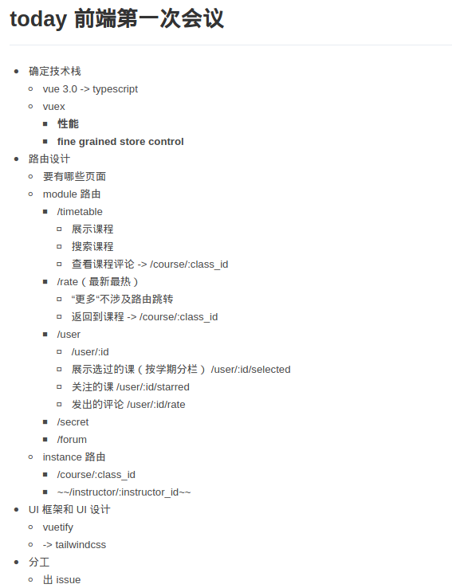

+++
title = "Fudan Today Sprint 1"
date = 2020-03-14T11:34:13+08:00
outputs = ["Reveal"]

[reveal_hugo]
slide_number = true
+++

# Fudan Today Sprint 1

* 报告人：马逸君
* Slides：张海斌

---

{}

## 项目目标

{}
* 课程安排功能（课程表）
* 课程讨论社区
* 匿名树洞与署名论坛
{}

---

### 课程安排

{}
{}
* 选课操作与取消操作
* 筛选课程
{}
{}

{}
{}

---

### 课程讨论社区

{}
{}
* 提供课程信息
* 课程评论
{}
{}

{}
{}

{}

---

{}

## Sprint 1 讨论结果

---

### 后端讨论截图

{}

{}

---

### 前端讨论截图

{}

{}

{}

---

### 用户故事

{}
* 作为 **学生**，我想要 **功能强大的选课系统** 以便 **我可以迅速查找到自己感兴趣的课程** 
* 作为 **学生**，我想要 **移动端适配的课表界面** 以便 **在手机上能清楚地查看课表** 
* 作为 **学生**，我想要 **对课程进行评论** 以便 **给其他选课同学提供参考** 
* 作为 **用户**，我想 **对课程评论进行回复** 以便 **从其他同学那了解更多信息** 
{}

---

### 前后端架构

{}

* 前端：
  * Vue.js + Vuetify
* 后端：
  * node.js + nest.js
  * MySQL

{}

---

{}

## API 设计

---

### 后端

{}
{}
* 课程信息
  * /course/:class_id
  * /course/:class_id/star
  * /course/:class_id/select
{}

{}
* 评课系统
  * /rate/class/:class_id
  * /rate/:rate_id
  * /rate/:rate_id/reply
{}
{}

---

### 前端

{}
{}
* 课表页面
  * /timetable
{}

{}
* 课程评论
  * /rate
{}

{}
* 用户信息
  * /user
{}
{}

{}

---

{}

### 任务分工

前后端以及 Scrum 团队角色

---

### 前后端分工

{}
{}
{}

#### 后端

* 解润芃
* 罗翔
{}
{}

#### 前端

* 李洪嵚
* 胡永祥
{}
{}
#### SRE（运维）

* 马逸君
{}
{}
#### 全栈

* 张海斌
{}
{}
{}

---

### Scrum 团队角色

{}
* Scrum Master、产品负责人：解润芃
* 开发团队：全体成员
{}

{}

---

{}

## GitHub 看板

---

### 后端

{}
{}
{}

---

### 前端

{}
{}
{}

{}

---

## Thanks
